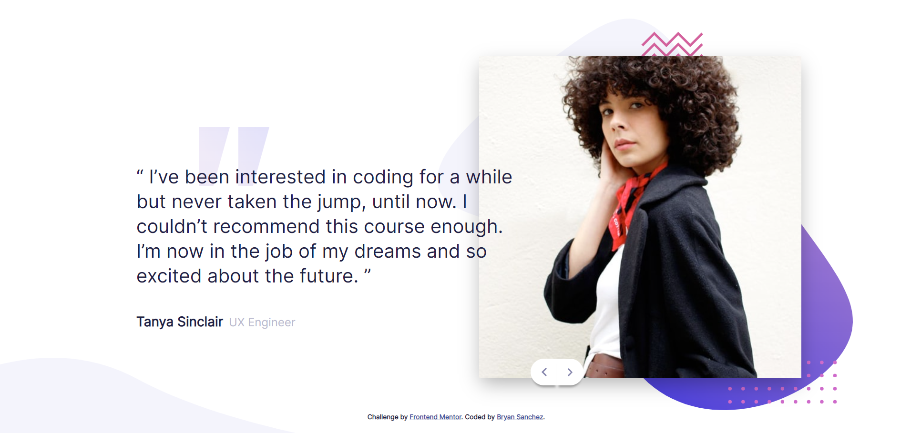

# Frontend Mentor - Coding bootcamp testimonials slider solution

This is a solution to the [Coding bootcamp testimonials slider challenge on Frontend Mentor](https://www.frontendmentor.io/challenges/coding-bootcamp-testimonials-slider-4FNyLA8JL). Frontend Mentor challenges help you improve your coding skills by building realistic projects. 

## Table of contents

- [Frontend Mentor - Coding bootcamp testimonials slider solution](#frontend-mentor---coding-bootcamp-testimonials-slider-solution)
  - [Table of contents](#table-of-contents)
  - [Overview](#overview)
    - [The challenge](#the-challenge)
    - [Screenshot](#screenshot)
    - [Links](#links)
  - [My process](#my-process)
    - [Built with](#built-with)
    - [What I learned](#what-i-learned)
    - [Continued development](#continued-development)
    - [Useful resources](#useful-resources)
  - [Author](#author)

## Overview

### The challenge

Users should be able to:

- View the optimal layout for the component depending on their device's screen size
- Navigate the slider using either their mouse/trackpad or keyboard

### Screenshot



### Links

- Solution URL: [Github](https://github.com/Bry-cmd/coding-bootcamp-testimonials-slider-master)
- Live Site URL: [Github Pages](https://bry-cmd.github.io/coding-bootcamp-testimonials-slider-master/)

## My process

### Built with

- Semantic HTML5 markup
- CSS custom properties
- CSS Grid
- Desktop-first workflow
- Vanilla JS
- SCSS

### What I learned

My first major learning from this challenge is figuring out how to be more purposeful with my HTML tags. Before, I'd mainly just use `div`'s whenever I needed a container and wanted to get in the practice of not just throwing `div`'s around. So, I did some research on when to use certain HTML tags and, from what I've understood, I decided to use the `main` and `section` tags. The `main` tag is, as the name implies, used to encapsulate the main content of the page. In this case, I used it as a container for the text and images of the page. I divided the container's left and right side into sections via the `section` tag, which is used to divide a page into different sections. The left side contained the text while the right contained the image and buttons used to navigate through the testimonials. I only used `div` tags when I needed containers to be nested inside these sections. In the end, my overall HTML structure looked roughly like so

```html
<main> <!-- Contains the entire main content of the page -->
  <section> <!-- Contains the entire left section of the main content -->
    <div> <!-- Contains the text of the testimonial -->
    </div>
  </section>
  <section> <!-- Contains the entire right section of the main content -->
    <div> <!-- Contains the image and buttons -->
    </div>
  </section>
</main>
```

My second big learning, which was the main reason I took up this challenge, was how to create animations in CSS. The code to create a simple one is as follows.

```css
@keyframes changeColor {
  from {
    background-color: yellow;
  }
  to {
    background-color: red;
  }
}

.container {
  animation-name: changeColor;
  animation-duration: 4s;
}
```

The code above animates an element with the class container using the animation named "changeColor", which changes the background color of the element from yellow to red in 4 seconds. The keyframes "changeColor" specifies what the animation does. In the `.container` class, the `animation-name` and `animation-duration` statements assigned the "changeColor" animation to it. Another way of assigning animations to an element is to create a class that specifies all the animation settings and then adding that class to an element we want to animate. For example,

```css
@keyframes changeColor {
  from {
    background-color: yellow;
  }
  to {
    background-color: red;
  }
}

.color-animation {
  animation-name: changeColor;
  animation-duration: 4s;
}
```

```html
<div container="container color-animation"></div>
```

I also learned how to create a slideshow using JavaScript, although most of the code I used was taken from a w3schools tutorial (thanks w3schools!). I commented the code in my JS file to explain what each line does so feel free to check it out!

Another major learning of mine over the course of this challenge was how to adjust the height of the body to fit the content of the page. In my previous challenges, I always struggled to figure out why the body of the HTML document didn't take up the entire space in my viewport. With a little research, I found that the following code fixes the issue by manually setting the height of the body to take up 100% of the viewport's height.

```css
body {
  min-height: 100vh;
}
```

Although this resolved my issue for the desktop design, I ended up coming across a little hiccup when I started with the mobile design, where I wanted the content to extend beyond the height of the viewport. However, since I set the body's height to 100vh, it wouldn't extend to fit the content of the page. With more research, I found that the following code allows the body's height to adjust to the height of the page's content (although I'm still figuring out how it really works).

```css
body {
  display: block;
  overflow: auto;
}
```

Another problem I came across while doing the challenge was the placement of the patterns to be used in the background. Based on my previous challenges, my go-to action would be to place multiple background images in the body and use the `background-position` statement to move them into the desired position.

```css
body {
  background-image: url("url/to/image1"), url("url/to/image2");
  background-position: 5rem 3rem, 3rem 5rem;
}
```

This solution did work when the page's size didn't change. However, it was a horrible solution for a responsive web page since the images would move as the page's width changed when I wanted them to be anchored to certain positions with respect to the main content. As a result, I scrapped this solution and found another one that worked perfectly.

```html
  <div class="parent">
    </img>
  </div>
```

```css
.parent {
  position: relative;
}

.image {
  position: absolute;
  top: 0rem;
  bottom: 0rem;
  right: 0rem;
  left: 0rem;
}
```

By setting the image's position to absolute, it removes the image from the normal flow of the document. By default, the `top`, `bottom`, `right`, and `left` statements change the position of the image with respect to the body of the document. However, by setting the image's parent's position to relative, these statements change the position of the image with respect to the image's parent. By doing so, I was able to anchor the background images to the main content of the page, which kept them in place even while the page's width was changing.

My final major learning from this challenge was how to use local custom fonts. In previous challenges, I would simply use a link along with the `@include` CSS statement to acquire the fonts needed to complete the challenge. Unfortunately, my internet connection has gotten really unstable so I decided to find a way to use the desired fonts locally. To do this, I first downloaded the fonts online and placed them in my project folder. I then used the following code to include the font in my project.

```css
@font-face {
    font-family: Inter;
    src: url('../fonts/Inter-VariableFont_slnt\,wght.ttf');
}
```

After running this code, I'm able to use the font on a sample element as follows.

```css
.sample-element {
  font-family: Inter;
}
```

### Continued development

For future challenges, I want to continue using more appropriate HTML tags since I'm still not confident when it comes to doing so. I also want to be able to learn more about CSS animations, specifically how to create more complex ones and how to control their execution (e.g. how to retrigger them after a certain amount of time). Finally, I want to improve upon my JS skills in future challenges and I hope to accomplish this by picking more JS-intensive challenges. I want to be more fluent in JS since many of the tools I want to learn, such as Node, React, and Express, utilize it.

### Useful resources

- [W3Schools](https://www.w3schools.com/) - This helped me refresh my memory on HTML, CSS, and JS
- [CSS Tricks](https://css-tricks.com/) - This is a great website that explains how to use CSS properly.
- [Stack Overflow](https://stackoverflow.com/) - This website has answers to every question I can think of when it comes to coding

## Author

- Website - [Github Pages](https://bry-cmd.github.io/coding-bootcamp-testimonials-slider-master/)
- Frontend Mentor - [@Bry-cmd](https://www.frontendmentor.io/profile/Bry-cmd)
- LinkedIn - [Bryan Sanchez](https://www.linkedin.com/in/bryan-sanchez-b316b7203/)